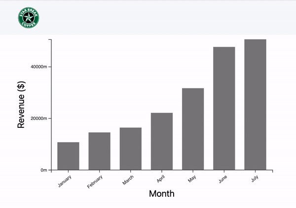
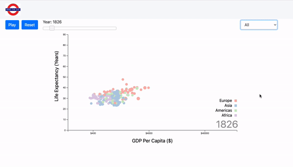
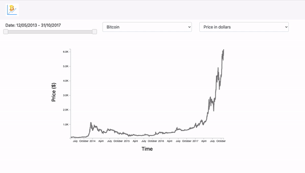
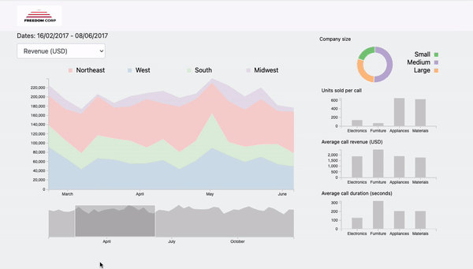

# publishing

playing with HTML, CSS

## Pre-Installation

In this repository, you might want to install
`live-server` package, which is simple but powerful local server.

1. Globally via npm

```
npm install -g live-server
```

## How to play?

Move to any root directory or folder however else you like. And then run the local server with the package we've just installed above.

```
live-server
```

Have fun!!

## Example

1. Starbreak - transitions



<br/>

2. Gapminder



<br/>

3. CoinStats



<br/>

4. FreedomCorp Dashboard

<br/>